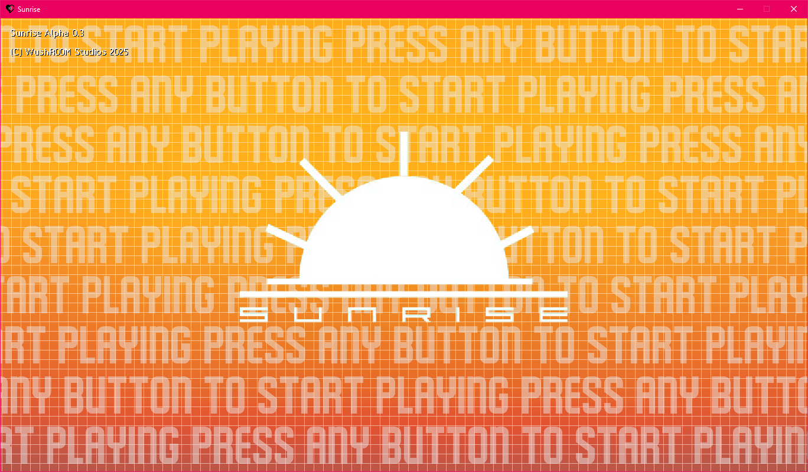

# Sunrise

If you're looking for a download link to the official compiled version, visit:
- [Official WushR00M Studios Page](https://www.wushroomstudios.com/store/sunrise).
- [Official Itch.IO Page](https://wrstudios.itch.io/sunrise).

## Prerequisites for Building
- [GameMaker (latest version)](https://gamemaker.io/en)
- [DirectX 11](https://www.microsoft.com/en-us/download/details.aspx?id=17431) (you CANNOT use DirectX 12)
- [Visual Studio 2019 / 2022](https://visualstudio.microsoft.com/downloads/) (Only if building with GM-YYC, ARM64 builds will ONLY build with VS 2022)
- System Specifics:
  - 2GB+ RAM
  - 5+ GB Storage
  - Windows 10 / 11

> [!NOTE]
> Windows 7 is no longer supported as of GM-Runtime version 2024.11 due to Microsoft dropping support for DirectX 11.

## Building Sunrise

To build the game, simply open up the project file (Sunrise.yyp) and hit the "Run" or "Debug" buttons. To stop running the game, hit the "Stop" button. To create a .ZIP file, click "Create Executable", click "Package as .ZIP", and then select a file location.

> [!WARNING]
> The game will NOT run properly on the HTML5 target. You will experience crashes, slowdowns, freezes, and the ability to not save.

> [!NOTE]
> To build Sunrise for Linux, Apple, and Android Devices, a seperate device is required as well as a valid keystore (Android exclusive). 

## Documetnation

For documentation on creating datapacks for Sunrise, [click here to go to the wiki page for Sunrise Datapacks.](https://github.com/WushR00M-Studios/Sunrise-Datapack-Wiki/wiki).
[Documentation for GameMaker Language (GML, Sunrise's primary programming language) is available here]()

## Credits
- Creator & Director - WushR00M / WushyAnimates
- Creator - UndergroundError

### Art & Design
- Lead Artist & Design - WushR00M / WushyAnimates
- Character Design - UndergroundError
- Character Design - Obvlixx
- Prop & Background Artist - Rose&Theo / Alex
- Concept Artist - TheBlueVolcano
- Guest Artist - Jason Lee (jasontomlee)

### Programming
- Lead Programming - WushR00M / WushyAnimates
- Programming - TheBlueVolcano
- Assistant Programming - SimonDoes
- Developer Tools - Juju (Julian) Adams

### Voice Talent
- Goodbye Voices:
  - WushR00M / WushyAnimates
  - TheBlueVolcano
  - H4949
  - LemonBluez
  - S&WProductions (ess)
  - XawoWasTaken
  - NoirStruck

### Music
- Lead Musician - WushR00M / WushyAnimates
- Musician - UndergroundError
- Musician - Caystel
- Musician - SpeheeSphereDude
- Guest Musician - Derpcat
- Guest Musician - sulflix
- Guest Musician - solare_system

### Sounds
- Sound Design - WushR00M / WushyAnimates
- Sound Design - XawoWasTaken
- Various Sources - Freesound.org

### Quality Assurance
- Design QA - TheBlueVolcano
- Design QA - Lampshade
- Design QA - Spacelord
- Design & Music QA - Rose&Theo
